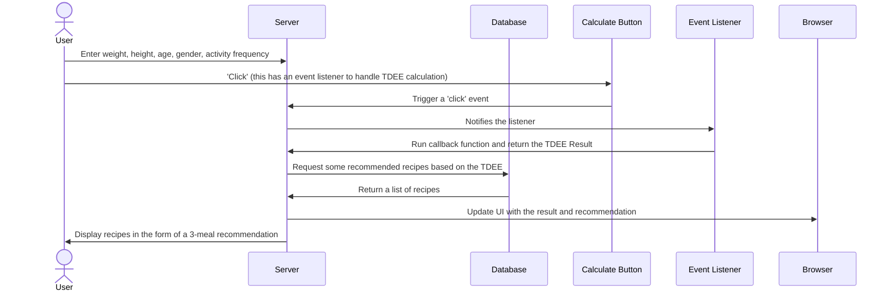

```mermaid
sequenceDiagram;
    actor User
    participant Server
    participant Database
    participant Calculate Button
    participant Event Listener
    User->>Server: Enter weight, height, age, gender, activity frequency
    User->>Calculate Button: 'Click' (this has an event listener to handle TDEE calculation)
    Calculate Button->>Server: Trigger a 'click' event
    Server->>Event Listener: Notifies the listener
    Event Listener->>Server: Run callback function and return the TDEE Result
    Server->>Database: Request some recommended recipes based on the TDEE
    Database->>Server: Return a list of recipes
    Server->>Browser: Update UI with the result and recommendation
    Server->>User: Display recipes in the form of a 3-meal recommendation
```
