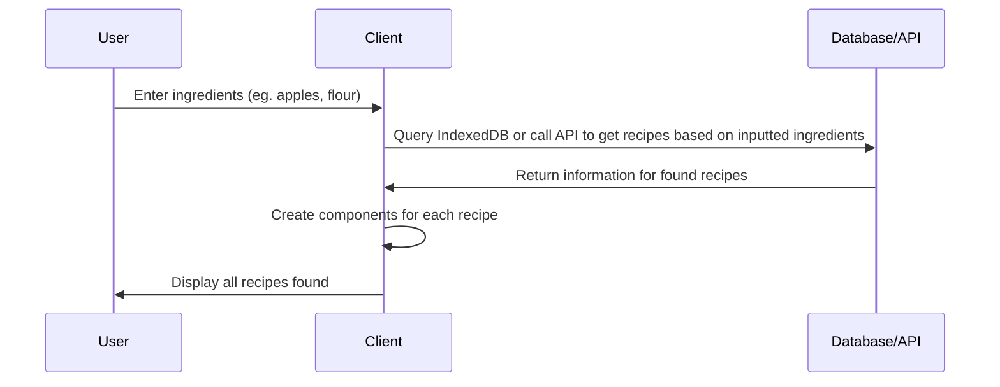

```mermaid
sequenceDiagram;
    participant User
    participant Client
    participant Database/API

    User->>Client: Enter ingredients (eg. apples, flour)
    Client->>Database/API: Query IndexedDB or call API to get recipes based on inputted ingredients
    Database/API->>Client: Return information for found recipes
    Client->>Client: Create components for each recipe
    Client->>User: Display all recipes found
```